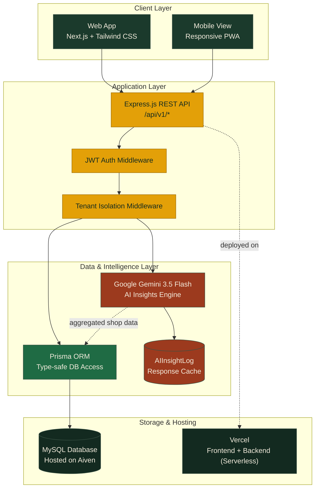
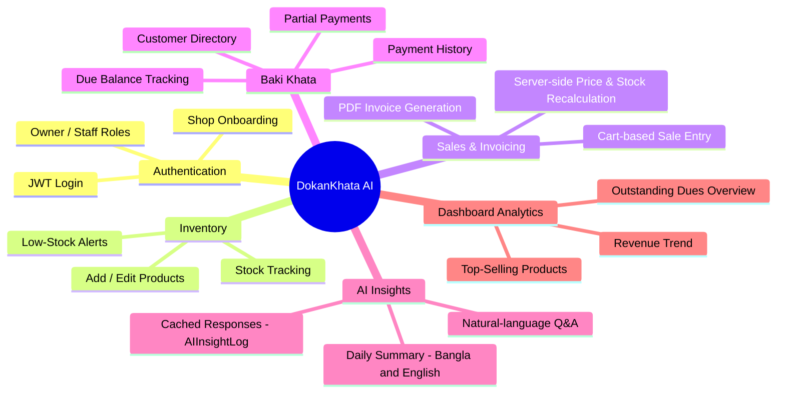
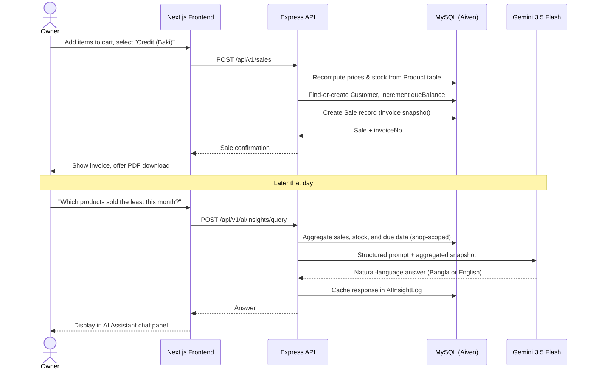

<div align="center">

# DokanKhata AI

### AI-Powered SaaS Business & Inventory Management Platform for Small Retailers and SMEs in Bangladesh

Digitizing the *baki khata* — with an AI assistant that reads your shop's numbers so you don't have to.

[](https://fu-prompt-coder-smuct-a844.vercel.app/)
[](https://github.com/sadmanarian004/Fu_Prompt_Coder_SMUCT)
[](#license)

**CSE Fest 2026 — Software Project Showcase**
Category: *Finance, FinTech & Digital Payments / Artificial Intelligence & ML*

</div>

---

## Table of Contents

- [Team](#team)
- [Abstract](#abstract)
- [Problem Statement](#problem-statement)
- [Objectives](#objectives)
- [Key Features](#key-features)
- [System Architecture](#system-architecture)
- [Core Functionality](#core-functionality)
- [Workflow — Recording a Credit Sale & AI Insight](#workflow--recording-a-credit-sale--ai-insight)
- [Technology Stack](#technology-stack)
- [Project Structure](#project-structure)
- [Getting Started](#getting-started)
- [Live Deployment Status](#live-deployment-status)
- [Challenges & Learnings](#challenges--learnings)
- [Future Scope](#future-scope)
- [AI Tool Disclosure](#ai-tool-disclosure)
- [References](#references)
- [License](#license)

---

## Team

**Team Name:** FU_Prompt_Coder
**Institution:** Feni University

| Name | Student ID | Role |
|---|---|---|
| **Abdullah Al Mamun Zishan** | 232031009 | Team Leader |
| **Abdullah Al Monir** | 242031022 | Team Member |
| **Md Sadman Islam Arian** | 242031004 | Team Member |

---

## Abstract

Micro, small, and medium retail businesses across Bangladesh — neighborhood shops (*dokans*), small distributors, and rural agri-input sellers — overwhelmingly still track sales, stock, and customer credit (*baki*) using paper ledgers or fragmented spreadsheets. This leads to stock-outs, uncollected dues, and an inability to make data-driven decisions.

**DokanKhata AI** is a bilingual (Bangla/English) SaaS platform that gives small business owners a simple, mobile-friendly way to manage inventory, sales, invoicing, and customer credit — while an integrated AI assistant (Google Gemini) automatically summarizes daily business performance, flags low-stock items, and answers natural-language questions such as *"which products sold the least this month?"* in the owner's own language.

---

## Problem Statement

- Manual, error-prone stock tracking causes stock-outs of fast movers and overstocking of slow movers.
- Customer credit (*baki khata*) tracked on paper leads to forgotten or disputed dues and lost revenue.
- No aggregated visibility into which products, categories, or customers actually drive profit.
- International SaaS accounting tools are expensive, English-only, and not designed around Bangladeshi credit-based retail workflows.
- Owners lack the time or technical background to turn raw transaction data into decisions.

---

## Objectives

- Build a multi-tenant SaaS platform for stock, sales, invoicing, and customer credit from a single dashboard.
- Provide a fully bilingual (Bangla/English) interface.
- Integrate an AI layer for automatic daily summaries, low-stock alerts, and natural-language Q&A grounded in the shop's own data.
- Implement secure, role-based authentication (Owner / Staff) with strict shop-level data isolation.
- Enable one-tap digital invoice (PDF) generation for every sale.
- Ship a mobile-responsive, low-maintenance, low-cost architecture.

---

## Key Features

| Feature | Description |
|---|---|
| 📦 **Inventory Management** | Add/edit products, track stock, set low-stock thresholds |
| 🧾 **Sales & Invoicing** | Record sales, auto-generate downloadable PDF invoices |
| 💳 **Baki Khata (Credit Ledger)** | Digital credit notebook — due balances, partial payments, payment history |
| 🤖 **AI Business Assistant** | Chat-style Q&A grounded in the shop's real sales/stock/due data |
| 📊 **Automated Daily Summary** | AI-generated performance summary, cached to control API cost |
| 🌐 **Bilingual Interface** | Full UI toggle between Bangla and English |
| 🔐 **Role-Based Access** | Separate Owner / Staff permissions, JWT-secured |
| 📈 **Dashboard Analytics** | Revenue trend, top products, low-stock alerts at a glance |

---

## System Architecture

DokanKhata AI follows a layered client-server SaaS architecture. The Next.js frontend communicates with an Express.js REST API over authenticated HTTPS requests. The API layer uses Prisma ORM against a MySQL database hosted on Aiven, and separately calls the Gemini API for AI-generated insights, which are merged with business data before returning to the client. Every request passes through shop-level tenant isolation so one shop's data can never be read by another.



---

## Core Functionality



---

## Workflow — Recording a Credit Sale & AI Insight

The sequence below illustrates two of the platform's core end-to-end flows: an owner recording a *baki* (credit) sale, and later asking the AI assistant about shop performance.



---

## Technology Stack

<div align="center">

| Layer | Technology |
|---|---|
| **Frontend** |     |
| **Backend** |    |
| **Database** |   |
| **AI Layer** |  |
| **Auth & Security** |   |
| **Hosting / DevOps** |   |
| **Validation** |  |

</div>

---

## Project Structure

```
dokankhata-ai/
├── frontend/                  # Next.js + Tailwind (Vercel)
│   └── src/
│       ├── app/               # Pages: landing, auth, dashboard modules
│       ├── components/        # Modals & reusable UI (inventory, sales, customers, ai)
│       ├── context/           # Bilingual LanguageContext
│       ├── hooks/             # useAuth, useAIInsights
│       └── lib/               # apiClient (axios + JWT interceptor)
│
└── backend/                   # Express.js + Prisma (Vercel serverless)
    ├── api/index.ts           # Serverless entry point
    ├── prisma/schema.prisma   # Shop, User, Product, Sale, Customer, Payment, AIInsightLog
    └── src/
        ├── controllers/       # auth, product, sale, customer, ai, invoice
        ├── services/          # gemini.service, shopSnapshot.service, auth.service
        ├── middleware/        # JWT auth, tenant isolation, error handling
        └── routes/            # Versioned REST endpoints (/api/v1/*)
```

---

## Getting Started

### Prerequisites
- Node.js 18+
- A MySQL database (e.g., a free [Aiven](https://aiven.io) instance)
- A [Google Gemini API key](https://aistudio.google.com/apikey)

### Backend

```bash
cd backend
npm install
cp .env.example .env        # fill in DATABASE_URL, JWT_SECRET, GEMINI_API_KEY
npx prisma generate
npx prisma migrate dev --name init
npm run prisma:seed         # optional demo data
npm run dev                 # http://localhost:5000
```

### Frontend

```bash
cd frontend
npm install
cp .env.local.example .env.local   # set NEXT_PUBLIC_API_URL
npm run dev                        # http://localhost:3000
```

---

## Live Deployment Status

- ✅ Deployed end-to-end on **Vercel** (frontend + backend) and **Aiven MySQL**
- ✅ Working authentication, inventory, sales/invoicing, and Baki Khata credit ledger
- ✅ AI daily summaries and chat assistant verified against live production data
- ✅ Shop-level tenant isolation enforced and tested across all resource endpoints

**Live Demo:** [fu-prompt-coder-smuct-a844.vercel.app](https://fu-prompt-coder-smuct-a844.vercel.app/)

---

## Challenges & Learnings

- Serverless Prisma requires an explicit engine type and binary target for Vercel's runtime.
- Frequent AI calls were controlled via daily-summary caching (`AIInsightLog`) rather than on-demand generation.
- Natural, non-literal Bangla AI output required iterative prompt engineering.
- Cross-shop data leakage is prevented with a dedicated tenant-isolation middleware, verified independently of authentication.
- TypeScript ambient type augmentations (`req.auth`) needed careful handling to survive Vercel's per-function build isolation.

---

## Future Scope

- bKash / Nagad / SSLCommerz integration for in-app digital due collection
- SMS/WhatsApp automated payment-due reminders
- Multi-branch support for owners operating more than one shop
- Offline-first mode with background sync for low-connectivity areas
- Voice-based Bangla data entry for low-literacy users
- Expanded AI forecasting for seasonal demand and supplier reorder suggestions

---

## AI Tool Disclosure

In line with the CSE Fest 2026 Rulebook (Section 13 — Intellectual Property & Ethics Policy), the team discloses the following:

- **Google Gemini 3.5 Flash** is used as a **core product feature** — the AI Insights Engine that generates daily summaries and answers owner queries from live shop data.
- An **AI coding assistant** was used substantially throughout development to help scaffold, debug, and iterate on the codebase (frontend components, backend controllers/services, Prisma schema, and deployment configuration).
- All architectural decisions, business logic requirements, data model design, and final implementation were directed, reviewed, and validated by the team members, who are able to explain every part of the system.
- No fabricated data or simulated results are presented as real outcomes; the "Live Deployment Status" section above reflects the actual, currently working production deployment.

---

## References

- [Next.js Documentation](https://nextjs.org/docs)
- [Tailwind CSS Documentation](https://tailwindcss.com/docs)
- [Express.js Documentation](https://expressjs.com/)
- [Prisma ORM Documentation](https://www.prisma.io/docs)
- [MySQL Reference Manual](https://dev.mysql.com/doc/)
- [Aiven for MySQL Documentation](https://aiven.io/docs/products/mysql)
- [Google Gemini API Documentation](https://ai.google.dev/gemini-api/docs)
- [Vercel Deployment Documentation](https://vercel.com/docs)
- [JWT.io — JSON Web Token Introduction](https://jwt.io/introduction)
- CSE Fest 2026 — Software Project Showcase, Official Rulebook v1.2, Department of CSE & CSIT

---

## License

This project is submitted for academic purposes as part of **CSE Fest 2026 — Software Project Showcase**. Ownership remains with the team members as per the event's Intellectual Property & Ethics Policy.

<div align="center">

**FU_Prompt_Coder** · Feni University · CSE Fest 2026

</div>
